# [Jinya CMS](https://jinya.de)

The Jinya CMS is a content management system specifically designed and developed for the needs of artists and designers.
It is developed by [Imanuel Ulbricht](https://imanuel.dev) and [Jenny Jinya](https://jenny-jinya.com), creator of the
popular Loving Reaper comics.

## Sites using the Jinya CMS

Currently, there are four websites based on the Jinya CMS. These four are listed here:

* [Loving Reaper](https://lovingreaper.com)
* [Jenny Jinya](https://jenny-jinya.com)
* [Imanuel Ulbricht Design](https://design.imanuel.dev)
* [Creastina](https://creatina.art)

## Technologies used

The Jinya CMS is based on the [Slim Framework 4](https://www.slimframework.com/). The frontend
uses [a fork](https://plates.jinya.dev/) of the [Plates](https://platesphp.com/) template engine. The backend, in Jinya
called designer, is written using [Svelte](https://svelte.dev/).

## Design
The Jinya default theme uses a very simple design, which focuses on your content and not on itself. You can preview the Jinya default theme [here](https://imanuel.ulbricht.design). Here are screenshots of the default theme.

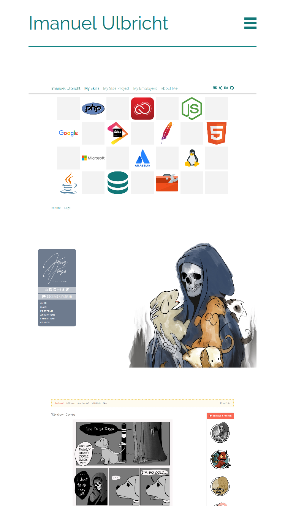
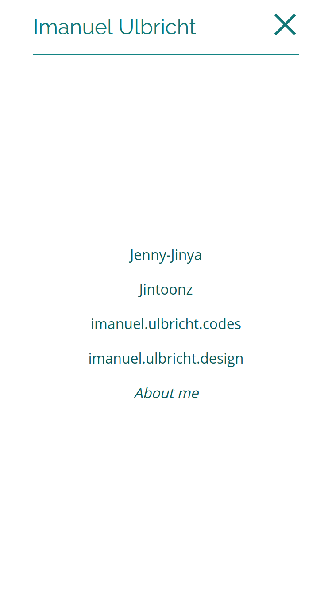
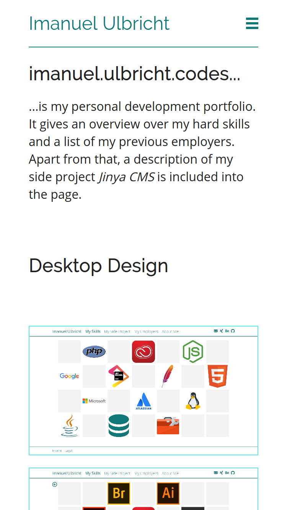
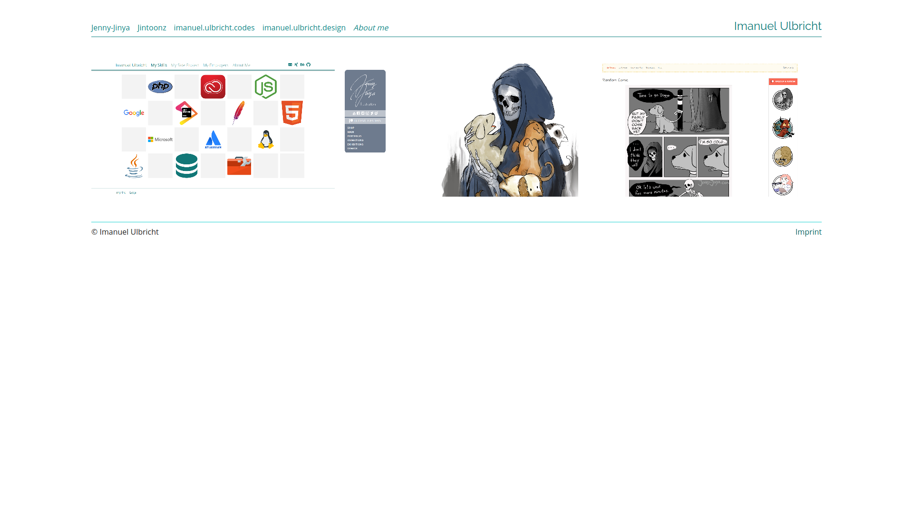
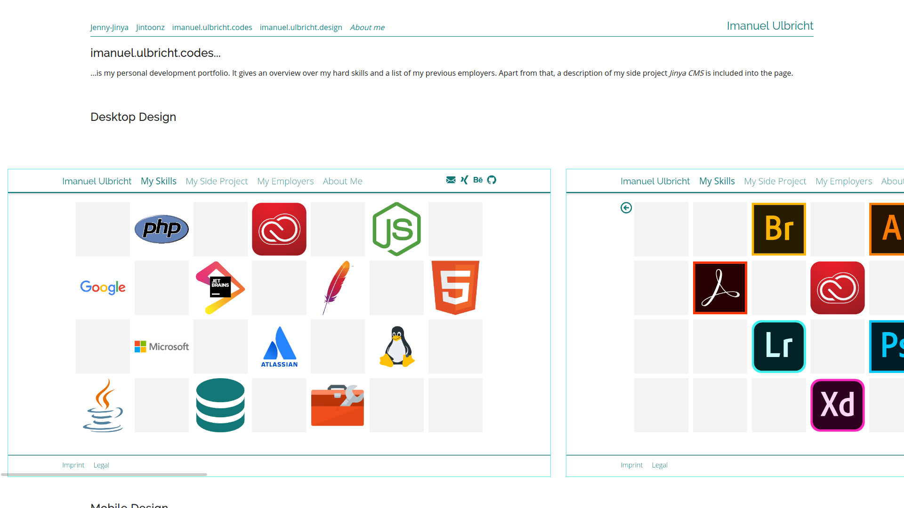

The designer uses the Cosmopolitan design from Microsoft, which later emerged in to the Modern UI Design Language. It is split in two areas, one is the Artistarea or Frontstage, the other one is the Adminarea or Backstage.

In the Artistarea you can manage all the content relevant to the frontend of your site. Here you arrange galleries, write pages and create forms. Apart from that, you can manage your menus, and the theme you are using. For managing your personal profile we created the My Jinya area. Here you can change your profile and control your logged in devices and saved devices.

To get a glimpse of the Artistarea, check the screenshots below.

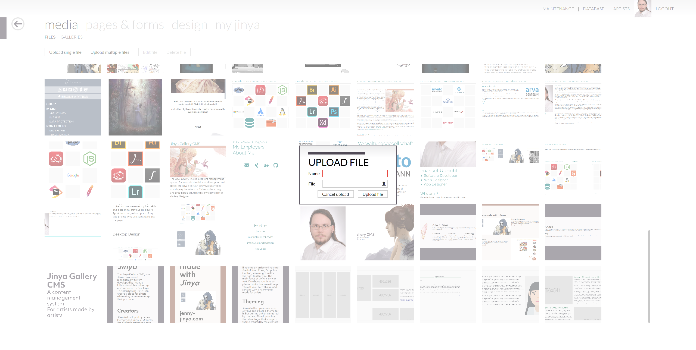
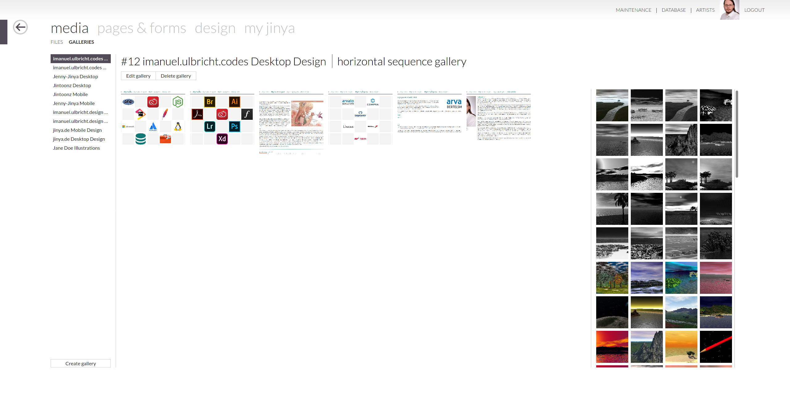

In the Adminarea you can check the database information, the PHP server info, the configuration of your Jinya instance and manage your artists.

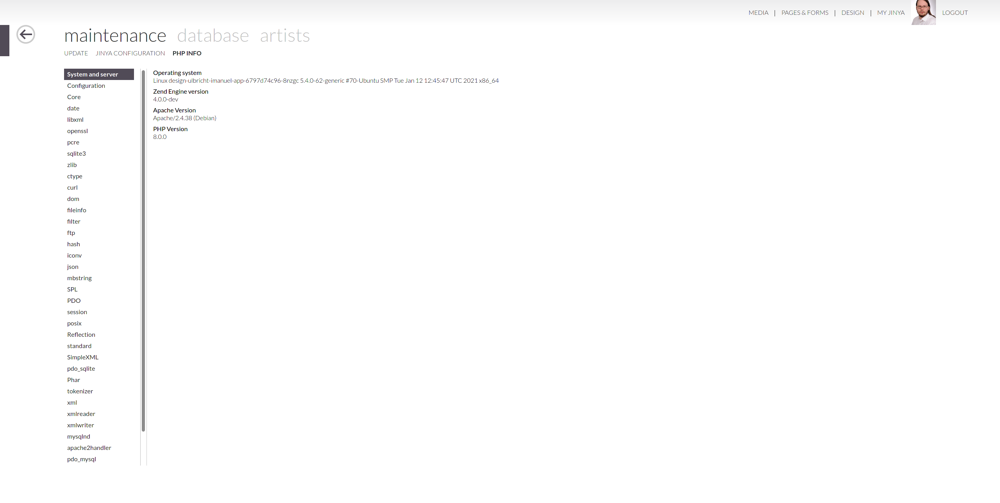
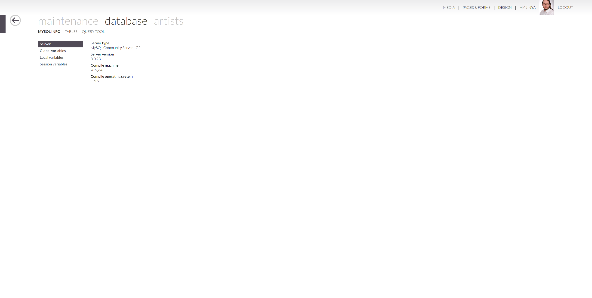
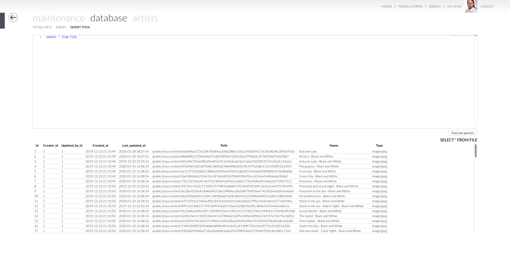
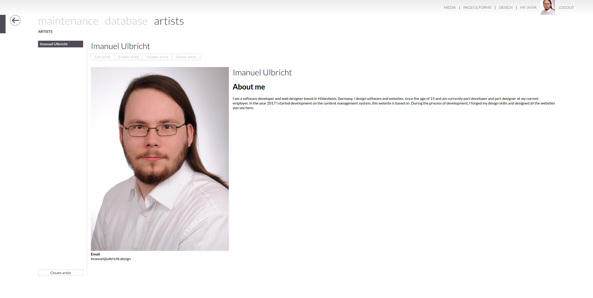

## How to install
If you want to install Jinya, you can grab the latest version from the releases here on Github. Just unzip the release folder in on your webserver and point your apache path mapping to the `public` directory.

Apart from that you can install the Jinya CMS with the docker container found at [https://hub.docker.com/repository/docker/jinyacms/jinya-cms](https://hub.docker.com/repository/docker/jinyacms/jinya-cms).

## Any questions?
If you still have any unanswered questions, feel free to raise an issue or send me an [email](mailto:me@imanuel.dev).

# License
The Jinya CMS is licensed under the MIT License.
